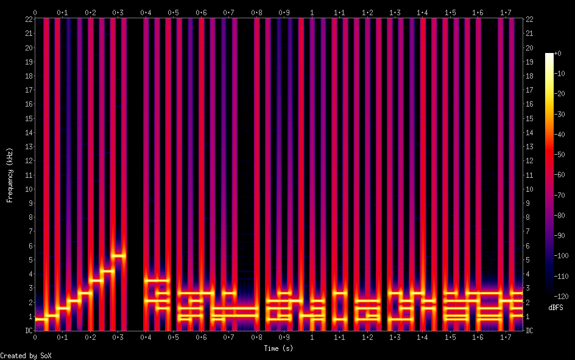
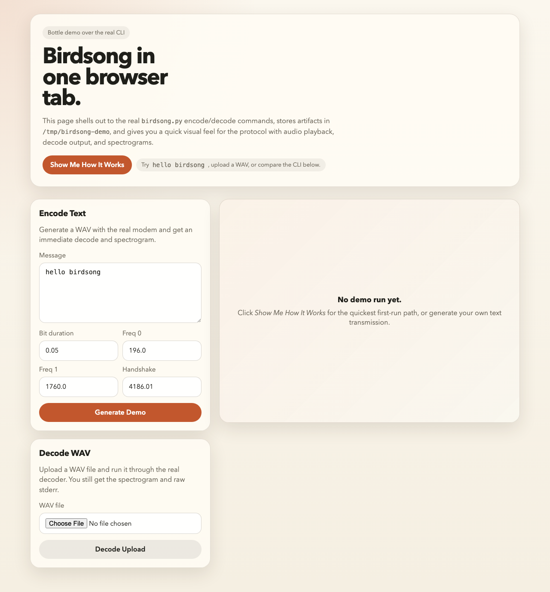
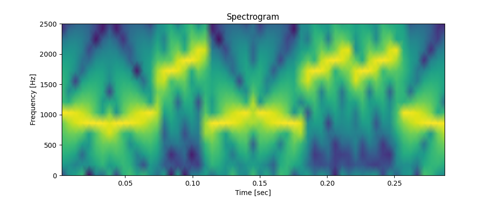

# Birdsong

Acoustic modem experiments centered on a small, file-and-pipe-friendly FSK
implementation in `birdsong.py`.



## Supported Core

`birdsong.py` is the supported entrypoint. It sends bytes from stdin, writes WAV
output to a file or stdout, and decodes from microphone, file, or stdin.

Current defaults:

- Sample rate: 44.1 kHz
- Bit duration: 50 ms
- Data frequencies: 196 Hz / 1760 Hz
- Handshake frequency: 4186.01 Hz
- Error detection: 8-bit checksum

Examples:

```bash
echo "hello" | uv run python3 birdsong.py send -o message.wav
uv run python3 birdsong.py recv -i message.wav

echo "hello" | uv run python3 birdsong.py send -o - | uv run python3 birdsong.py recv -i -
```

Common repo commands:

```bash
just check
just test
just demo
just e2e
just e2e-pipes
```

## Demo App

There is a small Bottle-based demo app for quickly seeing the modem in action
after cloning:

```bash
just demo
```

By default it serves on `http://127.0.0.1:8080/`.



It gives you:

- a one-click canned demo
- text-to-audio generation through the real `birdsong.py` CLI
- WAV upload + decode
- inline audio playback, spectrograms, and compact bit previews

The app is intentionally scrappy and file-backed. It uses the existing CLI path
for encode/decode rather than introducing a new application layer.

## Active Experiments

These remain visible and smoke-tested, but they are research code rather than
supported product surface:

- `experiments/active/birdsong_fsk_sweeps.py`
- `experiments/active/birdsong_8band.py`



## Archived History

Older or currently unsupported branches live in `experiments/archive/` and
`archive/`. This includes the bitmap prototype, earlier sweep and multiband
branches, the initial `poc.py`, and preserved coursework/challenge material.

The bitmap path remains archived on purpose. Its current prototype does not
round-trip reliably enough for incremental fixes; see
`docs/project_notes/bitmap_rebuild_ticket.md` for the rebuild scope.

## Tools

Utilities that help inspect or audition signals live in `tools/`:

- Bottle demo app
- spectrogram generation
- harmonic/crosstalk analysis
- note playback
- small debug helpers

## Development Notes

- Preserve fade-in/fade-out windowing in tone generation to avoid audio clicks.
- Favor deleting stale paths and unsupported claims over adding abstraction.
- Project notes and migration planning live in `docs/project_notes/`.
